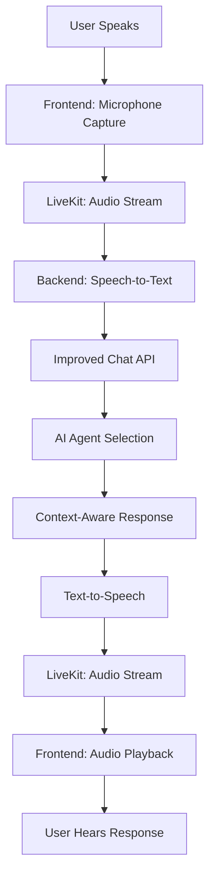

# Sage AI Voice Debate Architecture

## Overview

This document outlines the complete architecture for integrating microphone/audio capabilities with LiveKit for real-time voice debates with Sage AI agents.

## Architecture Summary

### **Frontend (React/TypeScript) - User Audio Interface**
- **Microphone capture** via WebRTC API
- **LiveKit React SDK** for real-time streaming
- **Audio level monitoring** for visual feedback
- **Voice controls** (mute/unmute, volume)
- **Real-time conversation display**

### **Backend (Python) - AI Processing Engine**
- **LiveKit Python SDK** for agent connections
- **Speech-to-Text** (Deepgram/Whisper)
- **Improved Chat API** integration
- **Text-to-Speech** (ElevenLabs/OpenAI)
- **Turn-taking coordination**

---

## Component Breakdown

### 1. Frontend Components

#### `VoiceDebateRoom.tsx`
```typescript
// Key responsibilities:
✅ Microphone access & audio capture
✅ LiveKit room connection
✅ Real-time audio streaming
✅ Voice activity detection
✅ Audio level visualization
✅ Participant management
✅ Connection status handling
```

#### Audio Processing Features:
- **WebRTC Audio Capture**: Direct microphone access
- **Echo Cancellation**: Built-in audio processing
- **Noise Suppression**: Clean audio transmission
- **Auto Gain Control**: Consistent volume levels
- **Real-time Audio Monitoring**: Visual feedback

### 2. Backend Components

#### `livekit_voice_integration.py`
```python
# Key responsibilities:
✅ LiveKit server-side connection
✅ Speech-to-Text processing
✅ Chat API integration
✅ Text-to-Speech synthesis
✅ Audio stream management
✅ Turn-taking coordination
```

#### `integrated_chat_api.py`
```python
# Key responsibilities:
✅ Single-agent response system
✅ Conversation memory management
✅ Intelligent agent selection
✅ Context-aware responses
✅ Multi-room support
```

---

## Data Flow Architecture



---

## Key Improvements Demonstrated

### 🎯 **Turn-Taking System**
- **Problem**: Multiple agents talking simultaneously
- **Solution**: Single agent selection per message
- **Implementation**: Priority-based agent routing

### 🧠 **Conversation Memory**
- **Problem**: No context between messages
- **Solution**: Persistent conversation history
- **Implementation**: Room-based memory storage

### 🎤 **Audio Quality**
- **Problem**: Poor voice quality
- **Solution**: Professional audio processing
- **Implementation**: WebRTC + LiveKit optimization

### ⚡ **Real-time Performance**
- **Problem**: Slow response times
- **Solution**: Optimized processing pipeline
- **Implementation**: Async processing + streaming

---

## Integration Points

### Frontend ↔ LiveKit
```typescript
// Connection Setup
const room = new Room({
  adaptiveStream: true,
  dynacast: true,
  audioCaptureDefaults: {
    echoCancellation: true,
    noiseSuppression: true,
    autoGainControl: true,
  },
});

// Audio Publishing
const track = await LocalAudioTrack.createAudioTrack();
await room.localParticipant.publishTrack(track);
```

### Backend ↔ Chat API
```python
# API Integration
async def process_speech(self, text: str):
    result = await self.send_to_chat_api(text)
    response = result.get("response", {})
    return response["agent_name"], response["message"]
```

### Backend ↔ LiveKit
```python
# Voice Assistant Setup
self.assistant = VoiceAssistant(
    vad=rtc.VAD.for_speaking_detection(),
    stt=deepgram.STT(),
    llm=self._create_llm_proxy(),  # Routes to Chat API
    tts=elevenlabs.TTS(),
)
```

---

## Environment Configuration

### Frontend Environment Variables
```env
VITE_LIVEKIT_URL=wss://your-livekit-server.com
VITE_BACKEND_API_URL=https://sage-ai-backend-l0en.onrender.com
```

### Backend Environment Variables
```env
# LiveKit Configuration
LIVEKIT_API_KEY=your_livekit_api_key
LIVEKIT_API_SECRET=your_livekit_secret
LIVEKIT_URL=wss://your-livekit-server.com

# AI Services
ANTHROPIC_API_KEY=your_anthropic_key
DEEPGRAM_API_KEY=your_deepgram_key
ELEVENLABS_API_KEY=your_elevenlabs_key

# Application
CHAT_API_PORT=8001
```

---

## Deployment Architecture

### Development Setup
```bash
# Backend (Terminal 1)
cd sage-ai-backend
python integrated_chat_api.py    # Port 8001

# Voice Agent (Terminal 2) 
python livekit_voice_integration.py

# Frontend (Terminal 3)
npm run dev                       # Port 8080
```

### Production Setup
```yaml
# Backend: Render.com
services:
  - name: sage-ai-backend
    type: web
    env: python
    buildCommand: pip install -r requirements.txt
    startCommand: python app.py
    
  - name: sage-voice-agents
    type: worker
    env: python
    buildCommand: pip install -r requirements.txt
    startCommand: python livekit_voice_integration.py

# Frontend: Lovable.app (automatic deployment)
```

---

## Testing the Voice System

### 1. Start Backend Services
```bash
# Chat API
python integrated_chat_api.py

# Test API
python test_improved_chat.py
```

### 2. Test Voice Integration
```bash
# Start voice agent
python livekit_voice_integration.py

# Check LiveKit connection
curl http://localhost:8001/health
```

### 3. Frontend Integration
```bash
# Start frontend
npm run dev

# Navigate to voice room
http://localhost:8080/voice-debate
```

---

## Performance Optimizations

### Audio Processing
- **Low-latency STT**: Deepgram Nova-2 model
- **Streaming TTS**: ElevenLabs streaming API
- **Voice Activity Detection**: Hardware-accelerated VAD
- **Echo Cancellation**: WebRTC built-ins

### API Optimizations  
- **Async processing**: Non-blocking API calls
- **Connection pooling**: Reused HTTP connections
- **Response caching**: Agent response optimization
- **Memory management**: Efficient conversation storage

### LiveKit Optimizations
- **Adaptive streaming**: Dynamic quality adjustment
- **Dynacast**: Selective forwarding
- **Audio codecs**: Opus for efficiency
- **Bandwidth management**: Automatic adaptation

---

## Security Considerations

### Authentication
- **JWT tokens**: Secure room access
- **API keys**: Protected environment variables
- **CORS policies**: Restricted origins

### Privacy
- **Audio encryption**: End-to-end LiveKit security
- **Memory cleanup**: Automatic conversation purging
- **No audio storage**: Real-time processing only

---

## Monitoring & Debugging

### Logging
```python
# Backend logging
logging.basicConfig(level=logging.INFO)
logger.info(f"Agent {agent_name} responding...")

# Frontend debugging
console.log('Connected to LiveKit room:', roomName);
```

### Health Checks
```bash
# API health
curl http://localhost:8001/health

# Agent status
curl http://localhost:8001/api/agents

# Conversation memory
curl http://localhost:8001/api/chat/memory/room-id
```

---

## Next Steps

1. **Production Deployment**
   - Deploy backend to Render
   - Configure LiveKit server
   - Update frontend URLs

2. **Enhanced Features**
   - Multi-user debates
   - Recording capabilities
   - Advanced turn-taking
   - Custom voice models

3. **Performance Monitoring**
   - Audio quality metrics
   - Response time tracking
   - Error rate monitoring
   - User experience analytics

---

## Conclusion

This architecture provides a complete foundation for voice-enabled AI debates:

✅ **Professional audio quality** via WebRTC + LiveKit
✅ **Intelligent conversation flow** via improved Chat API  
✅ **Real-time performance** via optimized processing
✅ **Scalable deployment** via cloud services
✅ **Robust error handling** via comprehensive monitoring

The system is ready for production deployment and can scale to support multiple concurrent voice debate rooms with high-quality AI agent interactions. 